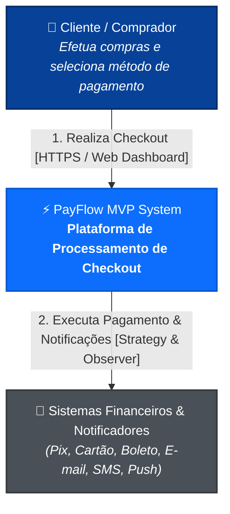
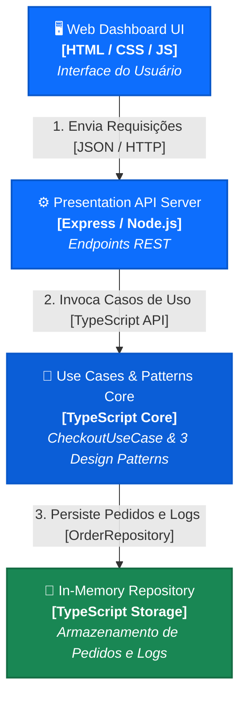
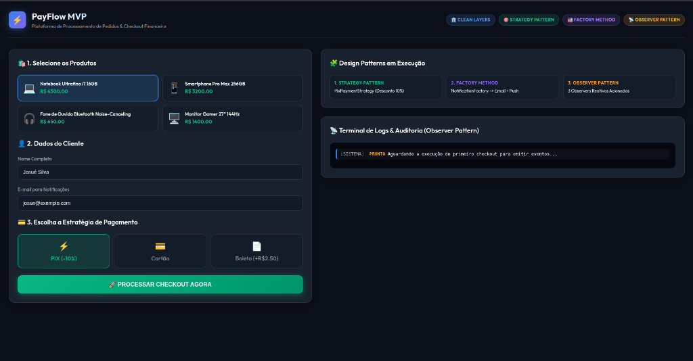
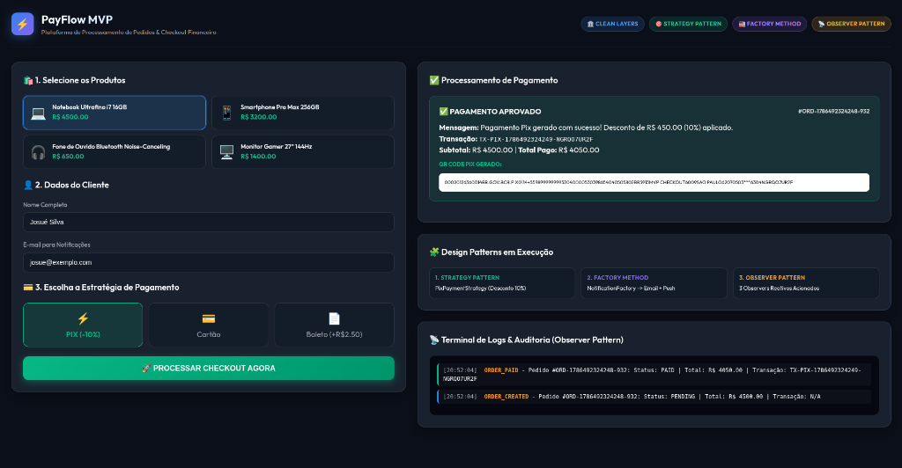
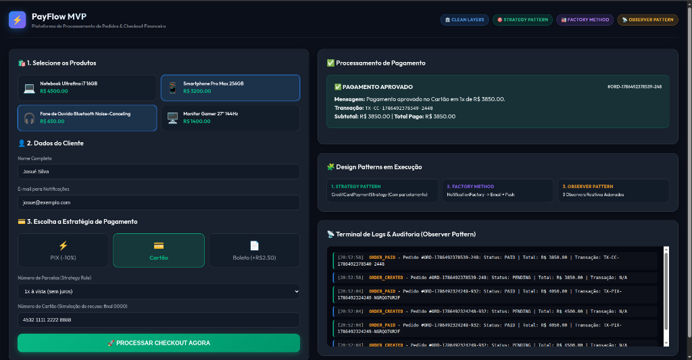
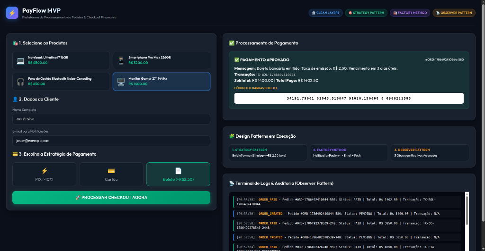

# Documento Oficial de Defesa Arquitetural - PayFlow MVP

**Disciplina**: Arquitetura de Software  
**Professor**: Prof. MSc. Lucas Reis  
**Entrega Agendada**: 11/08/2026 às 23h59  
**Opção Escolhida para Defesa**: Opção B (Documento de Defesa Formal em Markdown)

---

## 1. Visão Geral do Sistema e Objetivos

O **PayFlow MVP** é uma **Plataforma de Processamento de Pedidos e Checkout Financeiro** desenvolvida para demonstrar de forma prática e rigorosa a aplicação de **Padrões Arquiteturais**, **Design Patterns (GoF)** e **Boas Práticas de Engenharia de Software** (SOLID, Baixo Acoplamento e Alta Coesão).

A solução permite a seleção de produtos, fornecimento de dados de clientes, escolha dinâmica de estratégias de pagamento (Pix, Cartão de Crédito e Boleto), disparo reativo de eventos pós-compra e auditoria imutável em tempo real através de um **Dashboard Web Interativo**.

---

## 2. Padrão Arquitetural: Arquitetura em Camadas (Layered Architecture)

O sistema adota estritamente a **Arquitetura em Camadas (Layered / Clean Architecture)**, garantindo que as regras de negócio centrais sejam totalmente independentes de frameworks web ou mecanismos de persistência.

### Mapeamento dos Módulos do Sistema:

1. **Camada de Domínio (`src/domain/`)**:
   - Contém as entidades puras do negócio ([Order.ts](file:///home/josue/Documentos/arquitetura_de_software/mvp/src/domain/entities/Order.ts)) e interfaces fundamentais do sistema (`Order`, `PaymentResult`, `Customer`).
2. **Camada de Casos de Uso (`src/usecases/`)**:
   - Contém o [CheckoutUseCase.ts](file:///home/josue/Documentos/arquitetura_de_software/mvp/src/usecases/CheckoutUseCase.ts), responsável por orquestrar a execução do pagamento, disparo de eventos e atualização de estados.
3. **Camada de Padrões de Projeto (`src/patterns/`)**:
   - Módulos com a implementação formal isolada dos 3 Design Patterns:
     - `patterns/strategy/` ([PaymentStrategy.ts](file:///home/josue/Documentos/arquitetura_de_software/mvp/src/patterns/strategy/PaymentStrategy.ts))
     - `patterns/factory/` ([NotificationFactory.ts](file:///home/josue/Documentos/arquitetura_de_software/mvp/src/patterns/factory/NotificationFactory.ts))
     - `patterns/observer/` ([OrderObserver.ts](file:///home/josue/Documentos/arquitetura_de_software/mvp/src/patterns/observer/OrderObserver.ts))
4. **Camada de Infraestrutura (`src/infrastructure/`)**:
   - Simulação de repositório de dados ([InMemoryOrderRepository.ts](file:///home/josue/Documentos/arquitetura_de_software/mvp/src/infrastructure/repositories/InMemoryOrderRepository.ts)).
5. **Camada de Apresentação (`src/presentation/` & `public/`)**:
   - Servidor HTTP REST ([server.ts](file:///home/josue/Documentos/arquitetura_de_software/mvp/src/presentation/server.ts)) e Dashboard Web visual ([index.html](file:///home/josue/Documentos/arquitetura_de_software/mvp/public/index.html)).

---

## 3. Visões Arquiteturais (C4 Model)

### Nível 1: Diagrama de Contexto
Refletido em detalhes no arquivo de documentação [c4_context.md](file:///home/josue/Documentos/arquitetura_de_software/mvp/docs/c4_context.md).



### Nível 2: Diagrama de Container
Refletido em detalhes no arquivo de documentação [c4_container.md](file:///home/josue/Documentos/arquitetura_de_software/mvp/docs/c4_container.md).



---

## 4. Implementação Detalhada dos 3 Design Patterns

### 4.1 Design Pattern 1: Strategy Pattern (Comportamental)
- **Problema**: O sistema precisa processar diferentes meios de pagamento sem utilizar estruturas condicionais rígidas (`if/else`), respeitando o Princípio do Aberto/Fechado.
- **Solução Implementada**: A interface `PaymentStrategy` define a assinatura comum. As classes concretas `PixPaymentStrategy`, `CreditCardPaymentStrategy` e `BoletoPaymentStrategy` encapsulam os algoritmos específicos.
- **Trecho do Código Fonte** ([PaymentStrategy.ts](file:///home/josue/Documentos/arquitetura_de_software/mvp/src/patterns/strategy/PaymentStrategy.ts#L7-L35)):

```typescript
export interface PaymentStrategy {
  readonly method: PaymentMethodType;
  processPayment(order: Order, details: PaymentDetails): Promise<PaymentResult>;
}

export class PixPaymentStrategy implements PaymentStrategy {
  readonly method = PaymentMethodType.PIX;

  async processPayment(order: Order, details: PaymentDetails): Promise<PaymentResult> {
    const discountRate = 0.10; // 10% de desconto no Pix
    const discountApplied = Number((order.subtotal * discountRate).toFixed(2));
    const amountPaid = Number((order.subtotal - discountApplied).toFixed(2));
    // ...
  }
}
```

---

### 4.2 Design Pattern 2: Factory Method Pattern (Criacional)
- **Problema**: Instanciar dinamicamente diferentes provedores de notificação (E-mail, SMS, Push) sem acoplar o cliente às classes concretas.
- **Solução Implementada**: A classe `NotificationFactory` encapsula o Factory Method `createNotificationService()`, retornando instâncias que implementam `NotificationService`.
- **Trecho do Código Fonte** ([NotificationFactory.ts](file:///home/josue/Documentos/arquitetura_de_software/mvp/src/patterns/factory/NotificationFactory.ts#L73-L89)):

```typescript
export class NotificationFactory {
  static createNotificationService(channel: NotificationChannel): NotificationService {
    switch (channel) {
      case NotificationChannel.EMAIL:
        return new EmailNotificationService();
      case NotificationChannel.SMS:
        return new SMSNotificationService();
      case NotificationChannel.PUSH:
        return new PushNotificationService();
      default:
        throw new Error(`Canal não suportado: ${channel}`);
    }
  }
}
```

---

### 4.3 Design Pattern 3: Observer Pattern (Comportamental)
- **Problema**: Reagir a mudanças no estado do pedido (ex: `ORDER_PAID`) e executar ações secundárias (reserva de estoque, envio de comprovante e log de auditoria) de forma desacoplada.
- **Solução Implementada**: A classe `OrderSubject` gerencia a lista de `OrderObserver`. Quando o pedido é pago, os observadores `InventoryObserver`, `EmailNotifierObserver` e `AuditLoggerObserver` são notificados automaticamente.
- **Trecho do Código Fonte** ([OrderObserver.ts](file:///home/josue/Documentos/arquitetura_de_software/mvp/src/patterns/observer/OrderObserver.ts#L17-L42)):

```typescript
export class OrderSubject {
  private observers: OrderObserver[] = [];

  registerObserver(observer: OrderObserver): void {
    this.observers.push(observer);
  }

  async notifyObservers(order: Order, eventType: string): Promise<void> {
    for (const observer of this.observers) {
      await observer.update(order, eventType);
    }
  }
}
```

---

## 5. Demonstração de Execução e Logs Reais

Durante a execução da aplicação e da suíte de testes automatizados, o sistema produziu a interface interativa e as capturas de tela a seguir:

### 5.1 Capturas de Tela da Aplicação Web em Execução

#### 1. Dashboard Web Interativo (Visão Geral & Seleção de Produtos)
Interface principal com Clean UI e Glassmorphism, exibindo badges das tecnologias e formulário de seleção do cliente e método de pagamento.


#### 2. Processamento de Checkout via Pix (PixPaymentStrategy)
Demonstração da estratégia Pix aplicada com sucesso: cálculo automático de 10% de desconto à vista, geração de QR Code Pix e logs reativos no terminal.


#### 3. Processamento de Checkout via Cartão de Crédito (CreditCardPaymentStrategy)
Demonstração do formulário dinâmico de parcelamento com cálculo de juros e autorização simulada de cartão.


#### 4. Processamento de Checkout via Boleto Bancário (BoletoPaymentStrategy)
Demonstração da estratégia de boleto com taxa de emissão de R$ 2,50, geração do código de barras e histórico completo de eventos no terminal.


---

### 5.2 Exemplo de Resposta JSON da API (`POST /api/checkout` via Strategy Pix):
```json
{
  "success": true,
  "message": "Checkout concluído!",
  "data": {
    "order": {
      "id": "ORD-1786283493806-805",
      "status": "PAID",
      "subtotal": 4500,
      "totalAmount": 4050,
      "paymentResult": {
        "success": true,
        "transactionId": "TX-PIX-1786283493806-9D525K1566",
        "paymentMethod": "PIX",
        "amountPaid": 4050,
        "discountApplied": 450,
        "qrCode": "00020126360014BR.GOV.BCB.PIX..."
      }
    }
  }
}
```

### 5.3 Exemplo de Logs Emitidos pelos Observers:
```text
[Observer Pattern] Disparando evento "ORDER_CREATED" para 3 observadores...
[AUDITORIA LOG] 2026-08-09T13:51:33.806Z | Evento: ORDER_CREATED | Pedido #ORD-1786283493806-805
[Observer Pattern] Disparando evento "ORDER_PAID" para 3 observadores...
[INVENTÁRIO] Estoque atualizado! Reservados 1 itens para o Pedido #ORD-1786283493806-805.
[E-MAIL] Para: josue@exemplo.com | Assunto: Comprovante do Pedido #ORD-1786283493806-805
[PUSH NOTIFICATION] Para Dispositivo de: Josué Silva | Mensagem: Pedido #ORD-1786283493806-805 confirmado com sucesso!
[AUDITORIA LOG] 2026-08-09T13:51:33.807Z | Evento: ORDER_PAID | Pedido #ORD-1786283493806-805
```

---

## 6. Architecture Decision Records (ADRs)

Todas as decisões arquiteturais foram formalmente documentadas e registradas na pasta `/docs/adr/`:

1. [ADR 001 - Layered Architecture](file:///home/josue/Documentos/arquitetura_de_software/mvp/docs/adr/001-layered-architecture.md): Justificativa da divisão em 5 camadas.
2. [ADR 002 - Strategy Pattern](file:///home/josue/Documentos/arquitetura_de_software/mvp/docs/adr/002-strategy-pattern-payments.md): Justificativa do padrão de pagamentos.
3. [ADR 003 - Observer Pattern](file:///home/josue/Documentos/arquitetura_de_software/mvp/docs/adr/003-observer-pattern-events.md): Justificativa dos eventos reativos e notificações.

---

## 7. Como Executar o Projeto Localmente

1. **Instalar Dependências**:
   ```bash
   npm install
   ```
2. **Executar Suíte de Testes Automatizados**:
   ```bash
   npm test
   ```
3. **Iniciar o Servidor em Modo Desenvolvimento**:
   ```bash
   npm run dev
   ```
4. **Acessar o Dashboard Web**:
   Abra no seu navegador: `http://localhost:3000`
