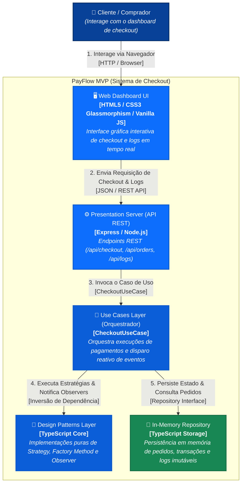

# Visão Arquitetural - C4 Model: Nível 2 (Containers)

O Diagrama de Containers ilustra a arquitetura interna do **PayFlow MVP**, detalhando a divisão de responsabilidades entre a interface Web, a API de Apresentação, os Casos de Uso, os Design Patterns e o Repositório de Dados.

## Mapeamento de Camadas e Responsabilidades

- **Presentation Layer (`web_ui` + `api_server`)**: Responsável apenas por receber HTTP e renderizar dados.
- **Use Cases Layer (`usecases`)**: Contém o `CheckoutUseCase`, garantindo que o fluxo de negócio seja independente de frameworks.
- **Design Patterns Layer (`patterns`)**: Isolamento explícito do Strategy, Factory Method e Observer.
- **Infrastructure Layer (`repo`)**: Repositório simulado em memória desacoplado via interface `OrderRepository`.
