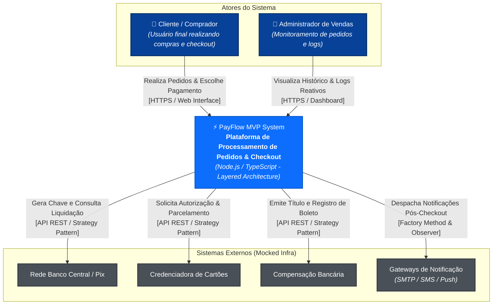

# Visão Arquitetural - C4 Model: Nível 1 (Contexto)

O Diagrama de Contexto descreve as fronteiras do sistema **PayFlow MVP**, seus atores (usuários/clientes) e os sistemas externos simulados com os quais se relaciona.

## Descrição dos Componentes e Atores

1. **Cliente / Comprador**: Acessa a interface web interativa do MVP, escolhe os produtos, fornece dados cadastrais e escolhe o método de pagamento.
2. **PayFlow MVP System**: O núcleo da aplicação desenvolvida em **Node.js/TypeScript** organizando as regras de negócio em camadas desacopladas.
3. **Sistemas Externos (Mocked Infra)**: Simulação dos provedores financeiros e de notificação integrados via os padrões **Strategy**, **Factory Method** e **Observer**.
